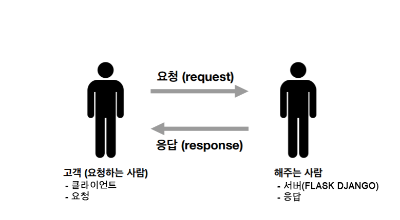
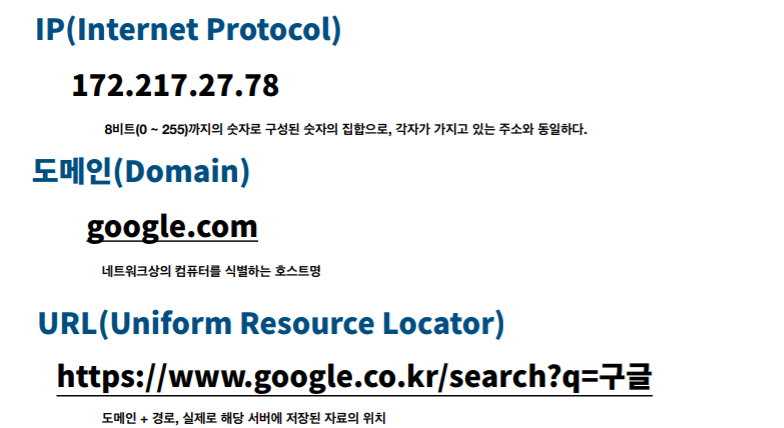

# 01_web

# 1. Intro to WEB Service

* 우리는 Web Site 를 만든다? X

* 우리는 Web Service 를 만든다? O

## Web + Service 에 대해 살펴보자 

#### Web = 거미줄(사전적 의미)

#### 	=  World Wide Web

* 인터넷에 연결된 컴퓨터들을 통해 사람들이 정보를 공유할 수 있는 전 세계적인 **정보공간**을 말한다

* 간단히 웹이라 부르는 경우가 많다. 이 용어는 인터넷과 동의어로 쓰이는 경우가 많으

#### Service를 두 가지로 나누어보았다

1. '무엇'을 주세요. →  '넵!' 이라고 하고 무엇을 받는다  ex) 마사지
2. '무엇'을 처리해주세요하고 무엇을 준다  →  '넵!'  ex) 우편서비스

## 결론

## 우리가 만들려고 하는 것은

### Server Computer(서버컴퓨터) 이다

| 클라이언트(Client) → |                |
| -------------------- | -------------- |
| 클라이언트(Client) → |                |
| 클라이언트(Client) → | → 서버(Server) |
| 클라이언트(Client) → |                |
| 클라이언트(Client) → |                |

- 클라이언트 컴퓨터에서 크롬을 포함한 여러가지 브라우저(Browser)를 통해서 → Server Computer(서버)요청을 보낸다

### 요청의 종류

* Get(나에게 내놔라)
  * Get(html 줄래?) → OK (/html)
* Post(보낼테니까 처리해줘)
  * Post(데이터) →  OK!

### 누가?

<사람User>이 요청(request)을 보낸다 → <컴퓨터 프로그램 Program>이  응답(response)을 해준다

## 따라서 들어오는 순간부터 보내는 것 까지가 우리의 담당영역

* Program과  response 까지가 우리가 개발할 것!

* 우리는 서버 컴퓨터에서 요청과 응답을 처리할 프로그램을 개발한다.

  

___

# 2. Static Web

- 정말 단순한 web

####   - 클라이언트가 요청을 보내면 서버가 응답한다

### Chrome the browser

- 아무것도 없는 컴퓨터에 하나만 설치해야 한다면? Chrome 을 깔아라!

  

#### /dir1/dir2/.../WantThis.file

#### 남의 컴퓨터 주소/dir1/dir2/.../WantThis.file(이게 해킹)

### 172.217.27.78 = google.com

------

# 3. Dynamic Web

## Web Application (Wep APP)

- http(s)://hphk/lectures/1

  

### 모든 웹서비스에서 달라고 하는 것은 URI 뿐이다!

#### URL

- 네트워크 상에서 자원이 어디 있는지를 알려주기 위한 고유 규약이다
- 흔히 웹사이트 주소로 알고 있지만 URL 웹사이트 주소 뿐만 아니라 컴퓨터 네크워크 상의 자원을 모두 나타낼 수 있다.

------

# 4. 개발 환경 준비

- 지금 상태로는 개발을 할 수 없어!

## 외않되?

### 1. 근본적으로 소프트웨어 환경이 다르다

- 컴퓨터의 구성요소는 하드웨어 + 소프트웨어(프로그램/도구)
- 집(하드웨어)은 똑같은데 안에 무엇을 넣느냐에 따라 카페가 될 수도 있고, 집이 될 수도 있다
- 따라서 소프트웨어가 중요하긔

그렇다면 소프트웨어만 설치하고 내  PC를 서버컴퓨터로 사용하면 되지 않나요?

### 2. 현실적으로 물리적으로 불가능하다

| PC(Personal Computer)                 | 서버컴퓨터(Server Computer)                   |
| ------------------------------------- | --------------------------------------------- |
| 나에게 필요한 프로그램들이 깔려있다   | 나에게 필요한 프로그램**만**이 깔려있다       |
| 내가 쓰는 용도에 맞는 성능을 가진다   | 내가 쓰는 용도에 맞는 성능을 가진다           |
| 보안에 있어 공격대상이 될 확률이 낮다 | 보안에 있어 공격대상이 될 확률이 낮다         |
| 꺼지기도 한다.                        | 절대 꺼지지도, 인터넷 연결이 끊겨서는 안된다. |

## 개발을 하는 방법

### 1. 내 컴퓨터

- 내컴퓨터에서 서버컴퓨터로 프로그램 & 코드를 보내는 가장 좋은 방법은?
- 답 : git hub를 사용한다

### 2. 새컴퓨터

#### 정리

- 계속 개발을 하게된다면 결국 종착역

- 과금 걱정 없음

- 원하는 IDE, Editor, Plugin  자유롭게 가능

#### cloud9

- 개발환경 거의 완성되어 있음

- GUI 개발 가능

- 바로 개발 결과물 공유 가능

- 언젠가는 로컬로 이전 필요

- 과금가능

- 개발환경에 있어 상대적으로 자유로움

