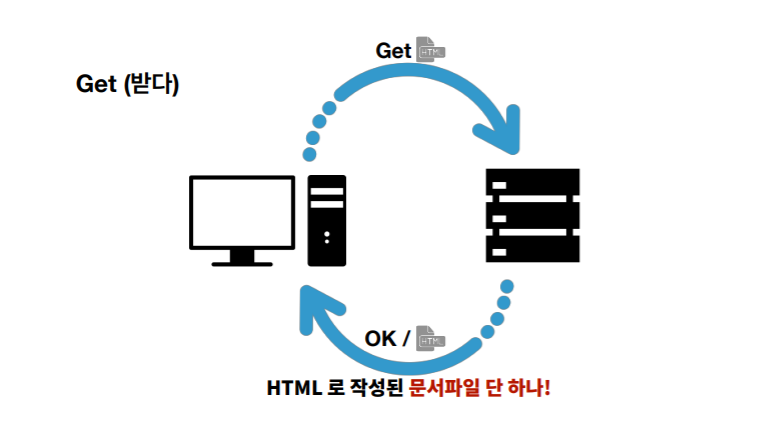
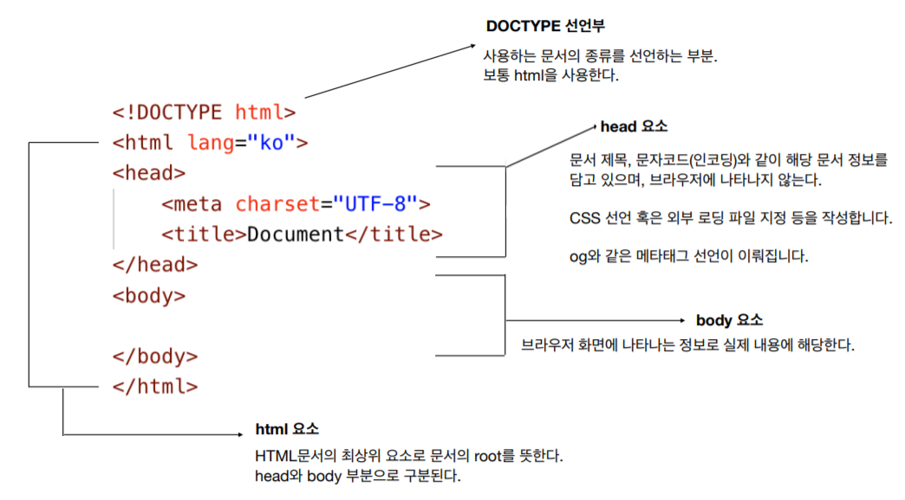
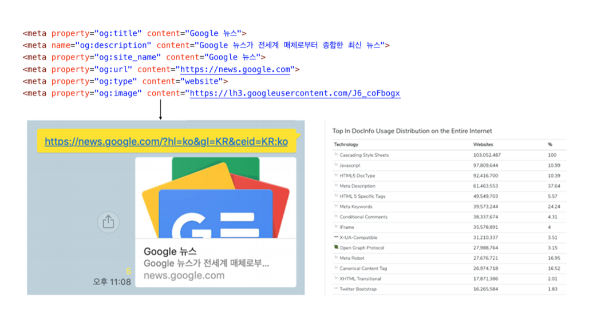
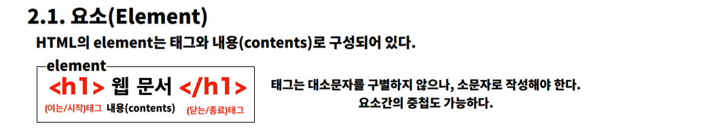
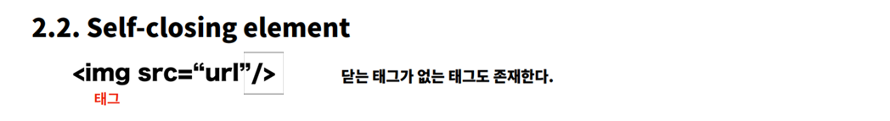
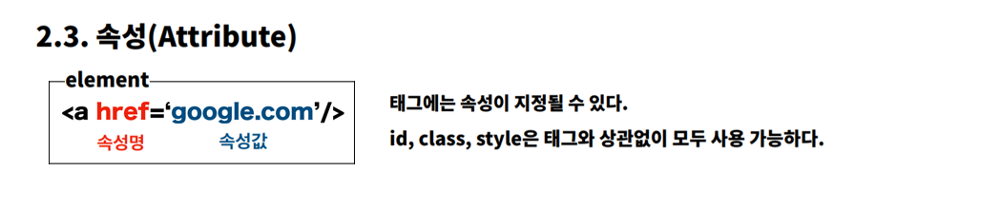
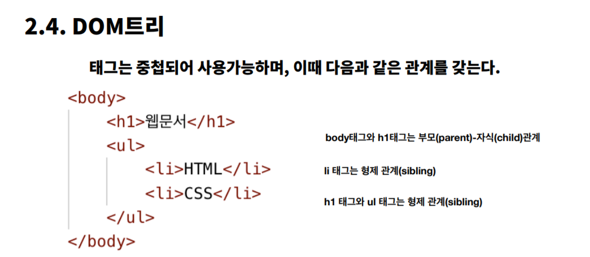
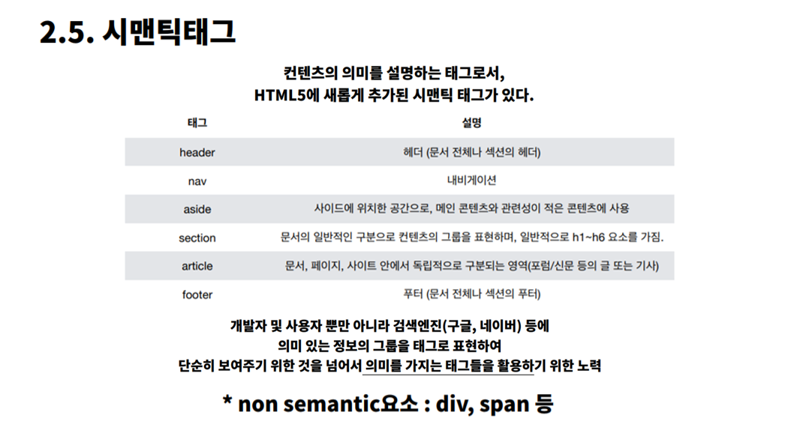
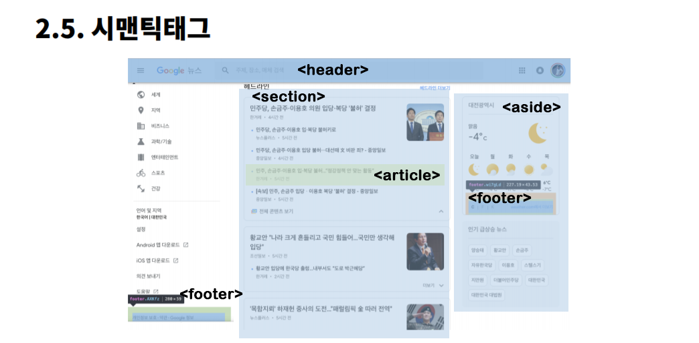
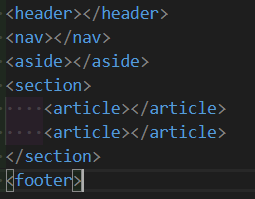

# 02_HTML

#### 05_HTML_CSS → code . → index. html/ markup.html 들어가서 복습하기


> #### https://validator.w3.org : HTML 코드 분석해주는 페이지
>
> - HTML은 코드 오류가 없다
> - 그래서 더 여럽다! 내가 알아서 체크 해야함
>
> #### chrome web developer (install 하기)
>
> - 상단바 - 톱니바퀴 - information - view document outline 하면 마크업 구조 나온다


## 1. HTML

#### 이게 뭔데 우리가 배우고 있죠?

- 웹페이지를 작성하기 위한 역할 작성 언어

  

### Hyper Text + Markup + Language

###  1. Hyper Text

- 기존의 텍스트 (책)

- 하이퍼 텍스트는 길이, 방향성, 순서도 없이 모든 것이 자유롭다.

- 따라서 기존 텍스트를 초월했다고 해서 하이퍼 텍스트라고 부른다

  

| Hyper Text를 주고 받는 규칙이 중요! = HTTP(S)                |
| ------------------------------------------------------------ |
| Hyper Text Transfer Protocol = HTTP(S)                       |
| 우리가 Hyper Text를 주고 받는 규칙을 지키겠다고 선언하는 것! |
| 보안을 강화하는 것이  HTTPS                                  |


###  2. Markup

- 글의 내용을 역할 별로 구별해 주는 것


###  3. Language

- 프로그램 언어는 아니지만 언어 이긴 하기 때문


##### 	→결론 : HTML은 웹페이지를 작성하기 위한 역할 작성 언어 이다


## 2. CSS

- Cascasding Style Sheet


## 3. Java Script

- 제대로 배울 때 까진 pass


## HTML 파일 : HTML로 작성된 문서파일

- 확장자랑 파일 안에 있는 문법은 다를 수 있다.




------


## 1. HTML 문서의 기본 구조








## 2. Tag와 DOM TREE (Document object model)




​	- 태그를 통해서 하나의 역할을 표시한다

​	- 하나의 태그 = object







```html
<li>HTML</li>
이 element는  li라는 tag 안에 content는 HTML 이며 attribute는 없다!
```

#### 	- id, class

​		- `<div id="exac-bio" class="bio-box">`

​		- 띄워쓰기대신 마이너스로 쓴다 

​		- id와 class 순으로 적는다

​		- 적는 문법에 대해서는 절대 섞지 마라!

​		- 고유한 값이기 때문에 요소 하나에 id는 1개만 존재한다

​		- class는 중첩 가능

 		- 숫자로 시작하지 못한다

​		- 다 소문자로 적는다

​		-  띄워쓰기로 클래스를 추가한다

​		-`<div class="bio-box red box">` : 3개의 class가 들어있다





```html
<!DOCTYPE html> #선언문 지금부터 이 문서는 html로 작성될 것입니다.
# html은  트리구조
<html lang="ko"> # 한국어로 바꾸기
# head 와 body 로 나눠져 있다
<head> # head 는 html의 정보를 담고 있다
    # meta는 기본 세팅
    <meta charset="UTF-8">
    <meta name="viewport" content="width=device-width, initial-scale=1.0">
    <meta http-equiv="X-UA-Compatible" content="ie=edge">
    <title>ryungs's github page</title>
</head>
<body> # body 안에 내용이 사용자에게 보여지는 내용
    <h1>Comming Soon..</h1>
</body>
</html>
```








