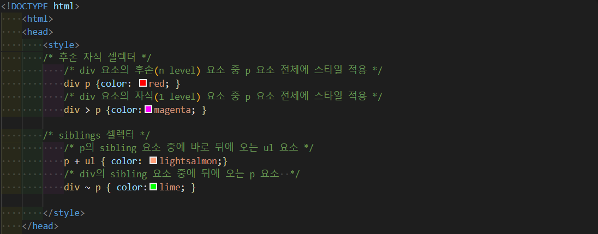

# CSS(cascading style sheet)

#### 05_HTML_CSS  → index.html 로 복습하기


## 01. CSS활용하기 

- 웹 문서의 전반적인 스타일을 미리 저장해 둔 스타일시트이다. 문서 전체의 일관성을 유지할 수 있고, 세세한 스타일 지정의 필요를 줄어들게 하였다.

- ##### Reset CSS 사용하기

  모든 웹 브라우저는 디폴트 스타일(브라우저가 내장하고 있는 기본 스타일)을 가지고 있어 CSS가 없어도 작동한다. 그런데 웹브라우저에 따라 디폴트 스타일이 상이하고 지원하는 tag나 style도 제각각이어서 주의가 필요하다.


```html
<link href="style.css" type="text/css" rel="stylesheet">
```

### 

## 02. selector


### 1. universal_selector(전체선택자)

| 패턴 | Description                                             |
| ---- | ------------------------------------------------------- |
| *    | html 요소를 포함한 모든 요소가 선택된(head 요소도 포함) |


### 2. tag_selector(태그선택자)

| 패턴   | Description                        |
| ------ | ---------------------------------- |
| 태그명 | 지정된 태그명을 가지는 요소를 선택 |


#### 2.1 그룹선택자

```css
h2, h3, p { background-color: lightgray; }
```


### 3. id/ class_selector (id, class 선택자)

- css 에서는 id는 최대한 안 불러오는게 맞다
- css 에서는 class로 불러와서 작업할 것!

| 패턴   | Description                                                  |
| ------ | ------------------------------------------------------------ |
| #id    | id 어트리뷰트 값을 지정하여 일치하는 요소를 선택<br />(id 어트리뷰트 값은 중복될 수 없다) |
| .class | class 어트리뷰트 값을 지정하여 일치하는 요소를 선택<br />(class 어트리뷰트 값은 중복될 수 있다.) |


 

### 4. attribute_selector (속성명 선택자)

| 패턴                      | Description                                                  |
| ------------------------- | ------------------------------------------------------------ |
| 셀렉터[어트리뷰트]        | 지정된 어트리뷰트를 갖는 모든 요소를 선택                    |
| 셀렉터[어트리뷰트="값"]   | 지정된 어트리뷰트를 가지며 <br />지정된 값과 어트리뷰트의 값이 일치하는 모든 요소를 선택 |
| 셀렉터[어트리뷰트~="값"]  | 지정된 어트리뷰트를 가지며 <br />지정된 값(공백으로 분리된)을 단어로 포함하는 요소를 선택 |
| 셀렉터[어트리뷰트\|="값"] | 지정된 어트리뷰트를 가지며<br />지정된 값과 일치 or 지정된 값 뒤에 `-`으로 시작하는 요소를 선택 |
| 셀렉터[어트리뷰트^="값"]  | 지정된 어트리뷰트를 가지며<br />지정된 값으로 시작하는 요소를 선택 |
| 셀렉터[어트리뷰트$="값"]  | 지정된 어트리뷰트를 가지며<br />지정된 값으로 끝나는 요소를 선택 |
| 셀렉터[어트리뷰트*="값"]  | 지정된 어트리뷰트를 가지며<br />지정된 값을 포함된 모든 요소를 선택 |


### 5. combinator_selector(복합/ 결합선택자)


- 자신의 1 level 상위에 속하는 요소를 부모 요소, 1 level 하위에 속하는 요소를 **자손 요소(자식 요소)**라한다.

- 자신보다 n level 하위에 속하는 요소는 **후손 요소(하위 요소)**라 한다.


#### 5.1 후손or 자손 선택자(descendent selector)

| 패턴                      | Description                                                  |
| ------------------------- | ------------------------------------------------------------ |
| 셀렉터A 셀렉터B {스타일;} | 셀렉터A의 모든 후손(하위) 요소 중 <br />셀렉터B와 일치하는 요소를 선택 |


#### 5.2 자식 선택자(child selector)

| 패턴                         | Description                                                  |
| ---------------------------- | ------------------------------------------------------------ |
| 셀렉터A  > 셀렉터B {스타일;} | 셀렉터A의 모든 자식 요소 중<br />셀렉터B와 일치하는 요소를 선택 |


#### 5.3 동위 선택자(sibling selector)

동위 관계란 HTML 요소의 계층 구조에서 같은 부모(parent) 요소를 가지고 있는 요소들을 의미

| 인접 동위 선택자(adjacent sibling selector) |                                                              |
| ------------------------------------------- | ------------------------------------------------------------ |
| 셀렉터A + 셀럭터B                           | 셀렉터A의 형제요소 중 셀렉터A **바로 뒤에** 위치하는 셀렉터B요소를 선택 |

| 일반 동위 선택자(general sibling selector) |                                                              |
| ------------------------------------------ | ------------------------------------------------------------ |
| 셀렉터A ~ 셀렉터B                          | 셀렉터A의 형제요소 중 셀렉터A **뒤에** 위치하는 셀렉터B요소를 모두 선택 |




### 6. pseudo_class_selector(가상 클래스 셀렉터)

- 가상 클래스는 요소의 특정 상태에 따라 스타일을 정의할 때 사용

- 가상 클래스는 마침표(.) 대신 콜론(:)을 사용


#### 6.1 링크 셀렉터(Link pseudo-classes), 동적 셀렉터(User action pseudo-classes)

| pseudo-class | Description                      |
| ------------ | -------------------------------- |
| :link        | 셀렉터가 방문하지 않은 링크일 때 |
| :visited     | 셀렉터가 방문한 링크일 때        |
| :hover       | 셀럭터에 마우스가 올라와         |
| :active      | 셀렉터가 클릭된 상태일 때        |
| :focus       | 셀렉터에 포터스가 들어와 있을 때 |


#### 6.2 UI 요소 상태 셀렉터(UI element states pseudo-classes)

| pseudo-class | Description                      |
| ------------ | -------------------------------- |
| :checked     | 셀렉터가 체크 상태일 때          |
| :enabled     | 셀렉터가 사용 가능한 상태일 때   |
| :disabled    | 셀렉터가 사용 불가능한 상태일 때 |


#### 6.3 구조 가상 클래스 셀렉터(Structural pseudo-classes)

| pseudo-class | Description                                              |
| ------------ | -------------------------------------------------------- |
| :first-child | 셀렉터에 해당하는 모든 요소 중 첫번째 자식인 요소를 선택 |
| :las-child   | 셀렉터에 해당하는 모든 요소 중 마지막 자신인 요소를 선택 |

| pseudo-class       | Description                                                  |
| ------------------ | ------------------------------------------------------------ |
| :nth-child(n)      | 셀렉터에 해당하는 모든 요소 중 앞에서 n번째 자식인 요소를 선택 |
| :nth-last-child(n) | 셀렉터에 해당하는 모든 요소 중 뒤에서 n번째 자식인 요소를 선택 |

| pseudo-class         | Description                                                  |
| -------------------- | ------------------------------------------------------------ |
| :first-of-type       | 셀렉터에 해당하는 요소의 부모 요소의 자식 요소 중 첫번째 요소 선택 |
| :last-of-type        | 셀렉터에 해당하는 요소의 부모 요소의 자식 요소 중 마지막 요소 선택 |
| :nth-of-type(n)      | 셀렉터에 해당하는 요소의 부모 요소의 자식요소 중 앞에서 n번째 요소 선택 |
| :nth-last-of-type(n) | 셀렉터에 해당하는 요소의 부모 요소의 자식요소 중 뒤에서 n번째 요소 선택 |


#### 6.4 부정 셀렉터(Negation pseudo-class)

| pseudo-class | Description                             |
| ------------ | --------------------------------------- |
| :not(셀렉터) | 셀렉터에 해당하지 않는 모든 요소를 선택 |


#### class 우선순위

inline → media 퀄 → 사용자 정의 → id → class (그 안에서는 쓰여진 순서대로) → 부모 상속 관계

→  tag


## 03. property 값의 단위

### 1. 키워드

- 개발자 도구로 확인
- 각 프로퍼티에 따라 사용할 수 있는 키워드가 존재한다. 예를 들어 [display 프로퍼티](https://poiemaweb.com/css3-display#1-display-%ED%94%84%EB%A1%9C%ED%8D%BC%ED%8B%B0)의 값으로 사용할 수 있는 키워드는 `block`, `inline`, `inline-block`, `none`이 있다.


### 2. 크기단위

- 대부분 브라우저의 폰트 사이즈 기본값은 16px, 1em, 100%이다. 
- 프로퍼티 값이 0인 경우, 단위를 생략할 수 있다.

#### 2.1 px(픽셀) - 절대값

- 디바이스의 해상도에 따라 상대적인 크기를 갖는다
- 대부분의 브라우저는 1px을 1/96 인치의 절대단위로 인식한다
- px은 요소의 크기나 이미지의 크기 지정에 주로 이용한다

#### 2.2 %

- 백분률 단위의 상대 단위
- 요소에 지정된 사이즈(상속된 사이즈나 디폴트사이즈)에 상대적인 사이즈를 설정


#### 2.3 em

- em은 상대 단위
- 요소에 지정된 사이즈(상속된 사이즈나 디폴트 사이즈)에 상대적인 사이즈를 설정
- 예를 들어 1em은 요소에 지정된 사이즈와 같고 2em은 요소에 지정된 사이즈의 2배이다.
- 폰트 사이즈 설정이나 콘텐츠를 포함하는 컨테이너의 크기 설정에 사용하면 상대적인 설정이 가능하여 편리하다
- 중첩된 자식 요소에 em을 지정하면 모든 자식 요소의 사이즈에 영향을 미치기 때문에 주의하여야 한다.
- 의도되지 않은 상황이라면 무척 난감한 상황일 수 있다. 즉, 상대 단위인 em의 기준이 **상속**의 영향으로 바뀔 수 있기 때문이다.

#### 2.4 rem

- **rem은 최상위 요소(html)의 사이즈를 기준**으로 삼는다. rem의 r은 root를 의미

- font-size 미지정 시에는 16px가 적용
- 사용자가 브라우저의 기본 폰트 크기를 변경하더라도 이에 따라 웹사이트의 레이아웃을 적절히 조정할 수 있다는 장점이 있다. 
- 따라서 폰트 사이즈 뿐만이 아니라 콘텐츠의 크기에 따라 가변적으로 대응하여야 하는 wrapper 요소(container) 등에 적합

#### 2.5 viewport 단위 (vh, vw, vmin, vmax)

- 반응형 웹디자인은 화면의 크기에 동적으로 대응하기 위해 % 단위를 자주 사용한다. 하지만 % 단위는 em과 같이 상속에 의해 부모 요소에 상대적 영향을 받는다.
- Viewport 단위는 상대적인 단위로 [viewport](https://poiemaweb.com/css3-responsive-web-design#viewport-meta-tag)를 기준으로 한 상대적 사이즈를 의미한다.

| 단위 | Description                                |
| ---- | ------------------------------------------ |
| vw   | viewport 너비의 1/100                      |
| vh   | viewport 높이의 1/100                      |
| vmin | viewport 너비 또는 높이 중 작은 쪽의 1/100 |
| vmax | viewport 너비 또는 높이 중 큰 쪽의 1/100   |

ex) viewport 너비가 1000px, 높이가 600px인 경우,

1vw = 10px/ 1vh = 6px/ vmin = 6px/ vmax = 10px


### 3. 색깔

| 단위 | Description                                                  |
| ---- | ------------------------------------------------------------ |
| HEX  | RGB 색상값을 각각 16진수로 변환, #ffffff                     |
| RGB  | 기본색(Red, Green, Blue)의 0부터 255까지의 값, rgb(0, 0, 0)  |
| RGBA | alpha(투명도 추가) 0.0 (완전 투명) and 1.0 (완전불투명), rgb(0, 0, 0, 0.5) |


## 04. box model

- 모든 HTML 요소는 Box 형태의 영역을 가지고 있다. Box 형태란 물론 사각형을 의미한다.
- 이 Box는 콘텐트(Content), 패딩(Padding), 테두리(Border), 마진(Margin)로 구성된다.


| 명칭    | Description                                                  |
| ------- | ------------------------------------------------------------ |
| Content | 요소의 텍스트나 이미지 등의 실제 내용이 위치하는 영역이다. <br />width, height 프로퍼티를 갖는다. |
| Padding | 테두리(Border) 안쪽에 위치하는 요소의 내부 여백 영역이다. <br />padding 프로퍼티 값은 패딩 영역의 두께를 의미하며 기본색은 투명(transparent)이다. <br />**요소에 적용된 배경의 컬러, 이미지는 패딩 영역까지 적용**된다. |
| Border  | 테두리 영역으로 border 프로퍼티 값은 테두리의 두께를 의미한다. |
| Margin  | 테두리(Border) 바깥에 위치하는 요소의 외부 여백 영역이다. <br />margin 프로퍼티 값은 마진 영역의 두께를 의미한다. <br />기본적으로 투명(transparent)하며 **배경색을 지정할 수 없다.** |


**박스모델에서 엘리먼트의 전체 너비는**

`margin-right` + `border-right` + `padding-right` + `width` + `padding-left` + `border-left` + `margin-left`

**엘리먼트의 전체 높이는**

`margin-top` + `border-top` + `padding-top` + `height` + `padding-bottom` + `border-bottom` + `margin-bottom`


### 1. width / height 프로퍼티

- 정되는 요소의 너비와 높이는 **콘텐츠 영역**을 대상
- 만일 width와 height로 지정한 콘텐츠 영역보다 실제 콘텐츠가 크면 콘텐츠 영역을 넘치게 된다는 것에 유의

```scss
overflow: hidden;을 지정하면 넘친 콘텐츠를 감출 수 있다.
```

- width와 height 프로퍼티를 비롯한 모든 박스모델 관련 프로퍼티(margin, padding, border, box-sizing 등)는 [상속](https://poiemaweb.com/css3-inheritance-cascading)되지 않는다.


### 2. margin / padding 프로퍼티

- margin / padding 프로퍼티는 content의 4개 방향(top, right, left, bottom)에 대하여 지정이 가능


- margin 프로퍼티에 `auto` 키워드를 설정하면 해당 요소를 브라우저 중앙에 위치 시킬 수 있다.
- `max-width` 프로퍼티는 요소 너비의 최대값을 지정
-  `min-width` 프로퍼티는 요소 너비의 최소값을 지정
- 예를 들어 `max-width: 300px;`의 경우, 브라우저의 너비가 300px보다 작아지면 요소 너비는 브라우저의 너비에 따라서 작아진다. `min-width: 300px;`의 경우 브라우저의 너비가 300px보다 작아져도 요소 너비는 지정 너비(300px)을 유지한다.


### 3. border 프로퍼티

- `border` 프로퍼티는 `border-width`, `border-style`, `border-color`를 한번에 설정하기 위한 shorthand 프로퍼티이다.

#### 3.1 border-style

- `border-style` 프로퍼티는 테두리 선의 스타일을 지정한다.

- 프로퍼티 값의 갯수에 따라 4개 방향(top, right, left, bottom)에 대하여 지정이 가능

#### 3.2 border-width

- `border-width` 프로퍼티는 테두리의 두께를 지정한다. 프로퍼티 값의 갯수에 따라 4개 방향(top, right, left, bottom)에 대하여 지정이 가능
- `border-width` 프로퍼티는 `border-style`과 함께 사용하지 않으면 적용되지 않는다.
- thin=1px medium=3px thick=5px

#### 3.3 border-color

- `border-color` 프로퍼티는 테두리의 색상을 지정한다. 프로퍼티 값의 갯수에 따라 4개 방향(top, right, left, bottom)에 대하여 지정이 가능
- `border-color` 프로퍼티는 `border-style`과 함께 사용하지 않으면 적용되지 않는다.

#### 3.4 border-radius

- `order-radius` 프로퍼티는 테두리 모서리를 둥글게 표현하도록 지정


### 4. box-sizing 프로퍼티

- `box-sizing` 프로퍼티는 width, height 프로퍼티의 대상 영역을 변경

| 키워드      | Description                                                  |
| ----------- | ------------------------------------------------------------ |
| content-box | width, height 프로퍼티 값은 content 영역을 의미한다. (기본값) |
| border-box  | width, height 프로퍼티 값은 content 영역, padding, border가 포함된 값을 의미 |


## 05. display 프로퍼티

- Bootstrdisplay 프로퍼티는 layout 정의에 자주 사용되는 중요한 프로퍼티이다.
- display 프로퍼티는 상속되지 않는다.

```css
셀렉터 {display : block;}
셀렉터 {display : inline;}
셀렉터 {display : inline-block;}
셀렉터 {display : none;}
```

| 프로퍼티값 키워드 | 설명                                                         |
| ----------------- | ------------------------------------------------------------ |
| block             | block 특성을 가지는 요소(block 레벨 요소)로 지정             |
| inline            | inline 특성을 가지는 요소(inline 레벨 요소)로 지정           |
| inline-block      | inline-block 특성을 가지는 요소(inline-block 레벨 요소)로 지정 |
| none              | 해당 요소를 화면에 표시하지 않는다 (공간조차 사라진다)       |

### 1. block

- 항상 새로운 라인에서 시작한다.
- 화면 크기 전체의 가로폭을 차지한다. (width: 100%)
- **width, height, margin, padding 프로퍼티 지정이 가능하다.**
- block 레벨 요소 내에 inline 레벨 요소를 포함할 수 있다.

- 9가지 : div, h1 ~ h6, p, ol, ul, li, hr, table, form


### 2. inline

- 새로운 라인에서 시작하지 않으며 문장의 중간에 들어갈 수 있다.
- content의 너비만큼 가로폭을 차지한다.
- **width, height, margin-top, margin-bottom 프로퍼티를 지정할 수 없다.**
  상, 하 여백은 line-height로 지정한다. 

- inline 레벨 요소 뒤에 공백(엔터, 스페이스 등)이 있는 경우, space(4px)가 자동 지정된다.
- inline 레벨 요소 내에 block 레벨 요소를 포함할 수 없다.
  inline 레벨 요소는 일반적으로 block 레벨 요소에 포함되어 사용된다.

- 9가지 : span, a, strong, img, br, input, select, textarea, button


### 3. Inline-block

- block과 inline 레벨 요소의 특징을 모두 갖는다.
- **inline 레벨 요소와 같이 한 줄에 표현되면서 width, height, margin 프로퍼티를 모두 지정할 수 있다.**

- content의 너비만큼 가로폭을 차지한다.
- inline 레벨 요소 뒤에 공백(엔터, 스페이스 등)이 있는 경우, space(4px)가 자동 지정된다.


### 4. None

- 해당 요소를 화면에 표시하지 않는다(공간조차 사라진다)


## 06. visibility의 프로퍼티

- `visibility` 프로퍼티는 요소를 보이게 할 것인지 보이지 않게 할 것인지를 정의한다. 즉, 요소의 렌더링 여부를 결정한다.

```css
셀렉터 {visibility: visible;}
셀렉터 {visibility: hidden;}
```

| 프로퍼티값 키워드 | Description                                                  |
| ----------------- | ------------------------------------------------------------ |
| visible           | 해당 요소를 보이게 한다 (기본값)                             |
| hidden            | 해당 요소를 보이지 않게 한다. <br />**display: none;은 해당 요소의 공간까지 사라지게 하지만 visibility: hidden;은 해당 요소의 공간은 사라지지 않고 남아있게 된다.** |
| collapse          | table 요소에 사용하며 행이나 열을 보이지 않게 한다.          |
| none              | table 요소의 row나 column을 보이지 않게 한다. IE, 파이어폭스에서만 동작하며 크롬에서는 hidden과 동일하게 동작한다. |


## 07. Position

- `position` 프로퍼티는 요소의 위치를 정의한다. top, bottom, left, right 프로퍼티와 함께 사용하여 위치를 지정한다.

```css
셀렉터 {position: static;}
셀렉터 {position: relative;}
셀렉터 {position: absolute;}
셀렉터 {position: fixed;}
```

### 1. static(기본위치)

- 기본적인 요소의 배치 순서에 따라 위에서 아래로, 왼쪽에서 오른쪽으로 순서에 따라 배치
-  부모 요소 내에 자식 요소로서 존재할 때는 **부모 요소의 위치를 기준으로 배치**
- 좌표 프로퍼티(top, bottom, left, right)를 같이 사용할 수 없으며 사용할 경우에는 무시된다.


### 2. relative

- static(기본 위치)를 기준으로 좌표 포로퍼티(top, bottom, left, right)를 사용하여 위치 이동


### 3. absolute

- **부모 요소 또는 가장 가까이 있는 조상 요소(static 제외)를 기준으로 좌표 프로퍼티(top, bottom, left, right)만큼 이동한다. **

- **즉, relative, absolute, fixed 프로퍼티가 선언되어 있는 부모 또는 조상 요소를 기준으로 위치가 결정된다.**

- **일 부모 또는 조상 요소가 static인 경우, document body를 기준으로 하여 좌표 프로퍼티대로 위치하게 된다.**

- 따라서 부모 요소를 배치의 기준으로 삼기 위해서는 부모 요소에 relative를 정의하여야 한다.

- **absolute 선언 시, block 레벨 요소의 width는 inline 요소와 같이 content에 맞게 변화되므로 적절한 width를 지정하여야 한다.**

- **relative 프로퍼티와 absolute 프로퍼티의 차이점**은 아래와 같다.

  relative 프로퍼티는 기본 위치(static으로 지정되었을 때의 위치)를 기준으로 좌표 프로퍼티(top, bottom, left, right)을 사용하여 위치를 이동시킨다. 따라서 **무조건 부모를 기준으로 위치**하게 된다.


### 4. fixed

- 부모 요소와 관계없이 브라우저의 viewport를 기준으로 좌표프로퍼티(top, bottom, left, right)을 사용하여 위치를 이동
- **스크롤이 되더라도 화면에서 사라지지 않고 항상 같은 곳에 위치**
- **ixed 프로퍼티 선언 시, block 요소의 width는 inline 요소와 같이 content에 맞게 변화되므로 적절한 width를 지정하여야 한다.**

