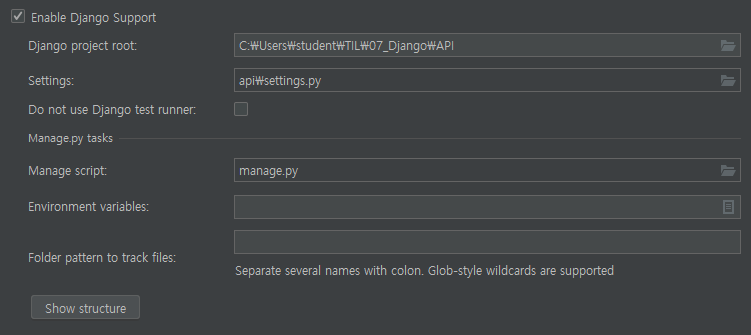

# Django -> API(Project) >movie_api(app)

```markdown
GET /Articles/1
Articles 요소중에서 id가 1인 페이지의 정보를 그대로 전달   (DB 데이터 변형 x)

GET /Articles/
Articles의 모든 요소가 저장되어 있는 곳을 보여주는 페이지를 전달   (DB 데이터 변형 x)

POST /Articles
Articles를 생성하는 등 변형된 자료 또는 새로 생성된 자료 전달해주는 것    (DB 데이터 변형 o)
```

```markdown
# 4개 url 필요

GET/articles/1 => 1번 조회

GET/articles => 전체 조회


GET/articles/1/edit => 1번 수정하는 페이지

PATCH/articles/1 => 1번 수정


GET/articles/new => 새로 데이터 입력하는 페이지

POST/articles/=> 새로 생성


DELETE/articles/1=> 1번 삭제
```


- pycharm → pure python  → pip install django → django startproject api . 

  → setting 에서 framework 에서 django 설정해주고	


#### django_rest_framework 처음 사용해봄!

```bash
student@M70324 MINGW64 ~/TIL/07_Django/API (master)
$ pip install django_rest_framework
```

```python 
INSTALLED_APPS = [
    'rest_framework',
```

```bash
python managy.py makemigrations
python managy.py migrate
```

```python
#views.py
# api 쓰면 import 하는게 다름

from django.shortcuts import get_list_or_404
from rest_framework.decorators import api_view # GET 요청
from rest_framework.response import Response # POST 요청
from .models import Movie
from .serializers import MovieSerializer
# Create your views here.

@api_view(['GET'])
def movie_list(request):
    movies = get_list_or_404(Movie)
    serializer = MovieSerializer(movies, many=True)
    return Response(serializer.data)

```

```bash
student@M70324 MINGW64 ~/TIL/07_Django/API (master)
$ touch movie_api/serializers.py # 직렬화
```

```python
#views.py 

from django.shortcuts import get_list_or_404
from rest_framework.decorators import api_view # GET 요청
from rest_framework.response import Response # POST 요청
from .models import Movie
from .serializers import MovieSerializer
# Create your views here.

@api_view(['GET'])
def movie_list(request):
    movies = get_list_or_404(Movie)
    serializer = MovieSerializer(movies, many=True)
    return Response(serializer.data)
```

```python	
# serializers.py
from rest_framework import serializers
from .models import Movie

class MovieSerializer(serializers.ModelSerializer):
    class Meta:
        model = Movie
        fields = '__all__'
```

```bash	
pip install faker
```

```python 
#models.py

from django.db import models
from faker import Faker
faker = Faker()

# Create your models here.
class Movie(models. Model):
    title = models.CharField(max_length=100)

    @classmethod
    def dummy(cls, n):
        for _ in range(n):
            cls.objects.create(
                title=faker.catch_phrase()
            )
```


- Postman 에서 GET 요청 날려봄